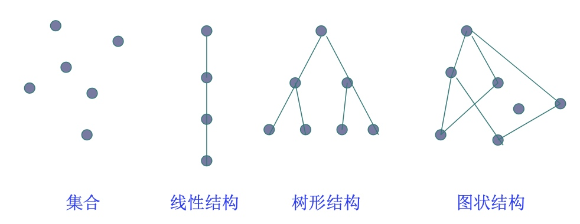

# Data Structure数据结构八天突击笔记

**目录**

[toc]

## Day1 绪论

**参考教材**

- [x] [华中科技大学数据结构Mooc链接🔗](http://www.icourse163.org/learn/HUST-1001907004?tid=1003064008#/learn/content?type=detail&id=1004302067&sm=1)
- [x] 严蔚敏，吴伟民，数据结构(C语言版)，清华大学出版社
- [x] Alfred V. Aho, John E.Hopcroft(Born in 1939, Turing Award Winner ), Jeffrey D. Ullman, Data Structures and Algorithms, 清华大学出版社

算法 + 数据结构 = 程序设计 

**基本数据结构:** 

> 线性结构:线性表、栈、队列、双队列
> 非线性结构:树、二叉树、图、网

**两类算法:**

>查找算法:顺序、折半、分块、哈希、二叉排序树
>
>直接插入、堆排序、2-路归并、快速排序

**相关术语:**

**1.**数据(data): 

所有能输入到计算机中并被计算机程序加工、处理的符号的总称。 如:整数、实数、字符、声音、图象、图形等。

**2.**数据元素(data element): 

数据的基本单位。(元素、记录、结点、顶点)

在计算机程序中通常作为一个整体进行考虑和处理。 

**3.**数据项(data item):

是数据的不可分割的最小单位。如:姓名、年龄等 一个数据元素可由一个或多个数据项组成。
 如: (姓名、年龄)

**4.**数据对象**(data object)**

由性质相同(类型相同)的数据元素组成的集合。

数据对象是数据的一个子集。

**5.** 数据结构(data structure)

四类基本结构:



**6**.数据的逻辑结构


**7**.数据的存储结构

数据结构在计算机存储器中的映象(mapping)。

存储结构也称为:存储表示,**物理结构**,物理表示。

顺序存储结构:如向量、一维数组

非顺序存储结构:链接表

**8.**数据类型(**data type)**

是一个值的集合和定义在这个值上的一组操作的总称。

(1)原子类型(如:int,char,float等)

(2)结构类型(如:数组,结构,联合体等)

**9.**抽象数据类型**(Abstract Data Type)** 与计算机的实现无关的数据类型。 形式定义:
 ADT 抽象数据类型名

{ 1.数据对象; 

2.数据关系:一个或多个关系; 

3.一组基本操作/运算

} ADT 抽象数据类型名


算法的5个特征:

(1)有穷性:在有限步(或有限时间)之后算法终止。

(2)确定性:无二义性。

(3)可行性:算法中的操作都是已经实现的基本运算执行有限次来实现的。

(4)输入:有0或多个输入量.

(5)输出:至少有一个输出量。


算法设计要求:

(1)正确性

a.无语法错误; b.对n组输入产生正确结果; c.对特殊输入产生正确结果; d.对所有输入产生正确结果。

(2)可读性:“算法主要是为了人的阅读与交流”。

(3)健壮性:不同的输入都要有相应的反应。 

(4)高效与低存储量


## Day2 线性表
**线性表**:由n(n≥0)个数据元素(a1,a2,..., an)构成的有限序列。
!! 空表是指不含数据元素的线性表,而不是表不存在的意思.
基本操作:
```
IniList(&L)
ListLength (L)
GetElem(L,i,&e)
PriorElem(L,ce,&pre_e)
InsertElem(&L,i,e) 
DeleteElem(&L,i) 
EmptyList(L)
```

线性表顺序结构在C语言中的定义(静态分配)

```c++
#define maxleng 100
typedef struct{
  int elem[100]
}
```


## Day3 栈和队列


## Day4 数组与广义表


## Day5 树与二叉树


## Day6 图


## Day7 查找


## Day8 内部排序